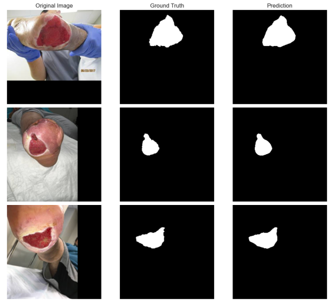
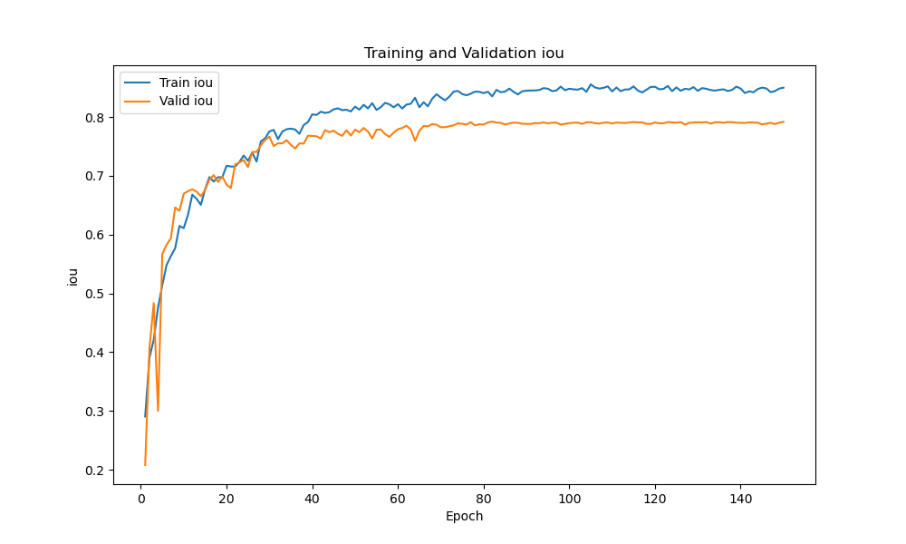

# Wound Segmentator   
This code allows you to train a segmentation model to predict wound areas on images.
>[!WARNING]  
>This prediction example contains wound images that may be graphic.
><details>
><summary>Example </summary>
>
></details>

## Installation
This code works fine on a cuda 11.6 and torch 1.13.0 version setup

```bash
# create and run virtual env
ENVNAME="wound_segmentator_env"
conda create -n $ENVNAME python==3.9.18 -y
conda activate $ENVNAME

# project installation
cd path/to/your/local/project/repository
git clone https://github.com/Le0Dev/wound_segmentator.git
pip install -r requirements.txt
```

## Download the data
Images dimensions = 512x512
Here you can find the splitted dataset: 
https://drive.google.com/file/d/1Npv4r5KZQzC1wYMeAjT6LKrOLkQb9Vdd/view?usp=sharing

## Training
```bash
# train command example
python train.py --data_path "./data/" --learning_rate 0.0001 --batch_size 8 --epochs 100 --img_size 256
```

Here you can download the pretrained weigths of an Attention-Unet (mean IoU of 0.71 over 552 test images)
https://drive.google.com/file/d/1diaAmDV7voPlDVHt0UfFE_ZD7XxqJnLF/view?usp=sharing
<details>
<summary>Attention-Unet</summary>

Training config: training set size = 2208 images (validation ratio = 0.2), 
img_size = 256,
criterion = DiceBCELoss,  
batch size = 8,
epochs = 150,
trained on a RTX3070Ti gpu
</details>

## Inference
inference.py is not implemented yet. Please use inference.ipynb notebook instead.

## Citation   
Some code comes from these projects:

- Model implementations: https://github.com/LeeJunHyun/Image_Segmentation
- Losses: https://www.kaggle.com/code/bigironsphere/loss-function-library-keras-pytorch

The data that has been used or modified in this project comes from these 3 works:
 - 374 images annotated from [1]
 - 1210 images (including 210 masks newly annotated) from [2]
 - 1176 images and masks refined from [3]

You can find the correspondance with the original dataset ids in correspondence_table.xlsx

[1] Thomas, S. Stock pictures of wounds. Medetec Wound Database (2020). http://www.medetec.co.uk/files/medetec-image-databases.html

[2] Wang, C., Anisuzzaman, D.M., Williamson, V. et al. Fully automatic wound segmentation with deep convolutional neural networks. Sci Rep 10, 21897 (2020). https://doi.org/10.1038/s41598-020-78799-w

[3] S. R. Oota, V. Rowtula, S. Mohammed, M. Liu and M. Gupta, "WSNet: Towards An Effective Method for Wound Image Segmentation," 2023 IEEE/CVF Winter Conference on Applications of Computer Vision (WACV), Waikoloa, HI, USA, 2023, pp. 3233-3242, doi: [10.1109/WACV56688.2023.00325](https://ieeexplore.ieee.org/document/10030591)https://ieeexplore.ieee.org/document/10030591


 
